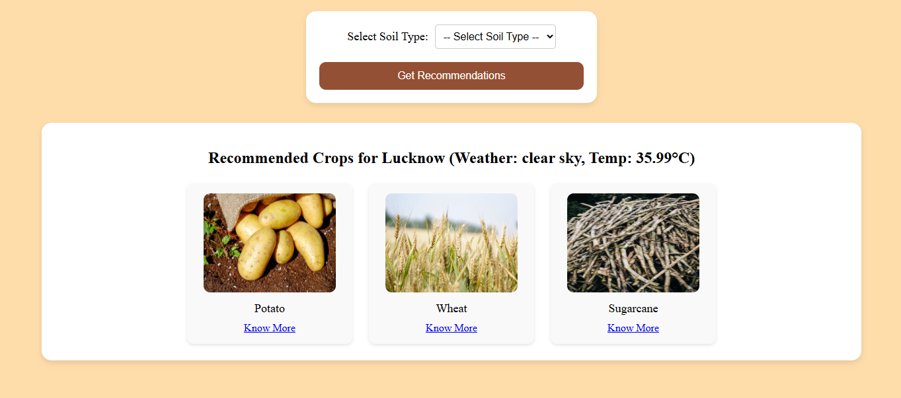

# 🌾 FasalForecast

**FasalForecast** is a smart and interactive crop recommendation web app built using **Node.js**, **Express**, **MySQL**, and **OpenWeather API**. The app delivers personalized crop suggestions based on real-time weather data and soil type, and visually enhances the experience using images from the **Pexels API**.

---

## 🚀 Features

- ☀️ **Weather Forecast** – Get live 5-day weather forecasts via OpenWeather API
- 📍 **City-Based Input** – Enter your city to get localized climate data
- 🌱 **Crop Recommendation** – Input your soil type to receive ideal crop suggestions from a MySQL database
- 🖼️ **Crop Visuals** – See images of suggested crops using Pexels
- 📖 **Know More** – Learn crop care tips retrieved dynamically from the database
- ✅ Clean structure, modular code, and EJS-based rendering for fast development

---

## 🛠️ Tech Stack

- **Backend:** Node.js, Express.js
- **Database:** MySQL (using `mysql2` and connection pooling)
- **APIs Used:**
  - [OpenWeatherMap](https://openweathermap.org/api) for weather data
  - [Pexels](https://www.pexels.com/api/) for crop images
- **Frontend:** EJS templates, HTML5, CSS3, Vanilla JS
- **Other:** dotenv for env management, Axios for API calls, CORS enabled

---

## 📁 Folder Structure

```
Farming-Agriculture-Assistant/
|
├── images/
│   └── soil.png
│   └── weather.png
|
├── models/                 # Mongoose schemas
│   ├── invoice.js
│
├── public/                 # Static files
│   └── app.js
│   └── css/
│       ├── crop.css
│       ├── home.css
│       ├── show.css
│       ├── weather.css
│
├── server/
│   └── index.js            # Main server entry point
|
├── views/                  # EJS templates
│   ├── crop.ejs
│   ├── home.ejs
│   ├── show.ejs
│   ├── weather.ejs
│
├── .env                    # Environment variables (ignored in git)
├── .gitignore              # Files/folders excluded from Git
├── LICENSE
├──package-lock.json        # Auto-generated lockfile for exact dependency versions
├── package.json            # Project metadata and dependencies
└── README.md

```

---

## ⚙️ Setup Instructions

### 1. Clone the Repository

```bash
git clone git@github.com:pprachhiii/Farming-Agriculture-Assistant-.git
cd Farming-Agriculture-Assistant
```

### 2. Install Dependencies

```bash
npm install
```

### 3. Create `.env` File

Create a `.env` in the root directory with your credentials:

```env
PORT=3000

# MySQL DB Config
DB_HOST=localhost
DB_USER=root
DB_PASSWORD=yourpassword
DB_PORT=3306
DB_NAME=fasal_db

# API Keys
OPEN_WEATHER_MAP_API_KEY=your_openweather_api_key
PIXELS_API_KEY=your_pexels_api_key
```

### 4. Start the App

```bash
npm start
```

Then go to:  
📍 `http://localhost:3000`

---

### 🔗 Live Demo

Check out the live app here: [FasalForecast Web App](https://farming-agriculture-assistant-production.up.railway.app)

## 📸 Screenshots

### 📋 Weather Page


### 📊 Soil-Recommendation Page



## 🧪 Sample Usage

1. **Weather Page:**  
   Visit `/weather` → enter your city → see forecast.

2. **Crop Recommendation:**  
   Click **Get Crop Recommendation** → choose soil type → receive suitable crops with images.

3. **Know More:**  
   Click **Know More** under a crop → read detailed care tips fetched from `crop_care_tips` table in MySQL.

---

## 🗃️ MySQL Tables (Example)

- `crop_recommendations`

  ```sql
  CREATE TABLE crop_recommendations (
  id INT AUTO_INCREMENT PRIMARY KEY,
  city VARCHAR(100),
  region VARCHAR(100),
  temp_min INT,
  temp_max INT,
  humidity_min INT,
  humidity_max INT,
  wind_max INT,
  soil_types VARCHAR(255),
  recommended_crops VARCHAR(255)
  );
  ```

- `crop_care_tips`
  ```sql
  CREATE TABLE crop_care_tips (
    id INT AUTO_INCREMENT PRIMARY KEY,
    crop_name VARCHAR(100),
    best_season VARCHAR(100),
    ideal_temp_min INT,
    ideal_temp_max INT,
    ideal_soil_types VARCHAR(255),
    watering_frequency VARCHAR(100),
    common_diseases VARCHAR(255),
    fertilizers VARCHAR(255),
    care_tips TEXT
  );
  ```

---

## 📌 .gitignore Includes

```gitignore
node_modules/
.env
```

---

## 💡 Future Enhancements

- 🌐 Add multi-language support
- 🧠 Integrate ML-based recommendation logic
- 🧕 User login and saved recommendations
- 📄 Export crop suggestions to PDF
- 📨 Email recommendations to users

---

## 📬 Contact

Made with ❤️ by **Prachi Yadav**

> Want to contribute or report an issue? Fork this repo or open an issue on GitHub!

## 🪪 License

MIT — Copyright © 2025 Prachi Yadav
See [LICENSE](./LICENSE) for full text.
